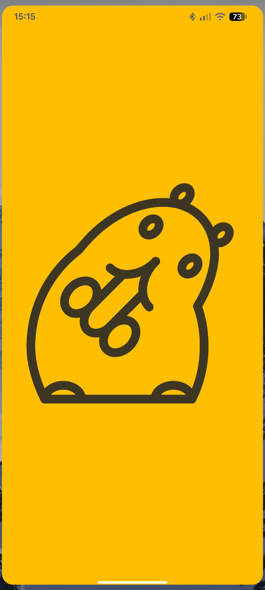
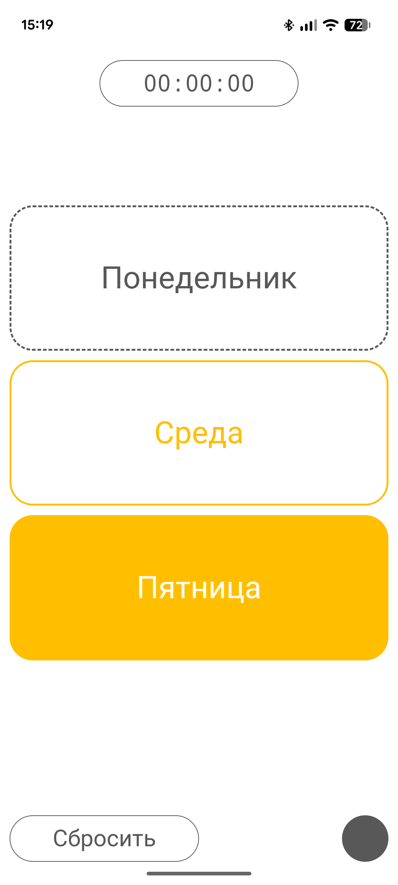
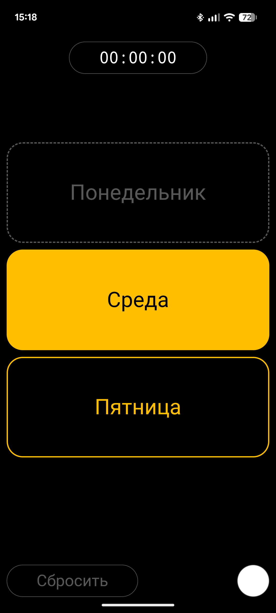
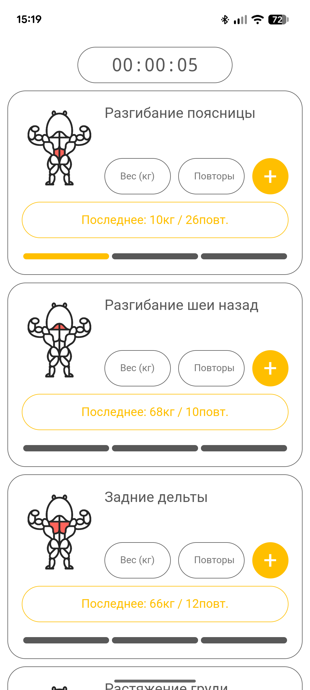
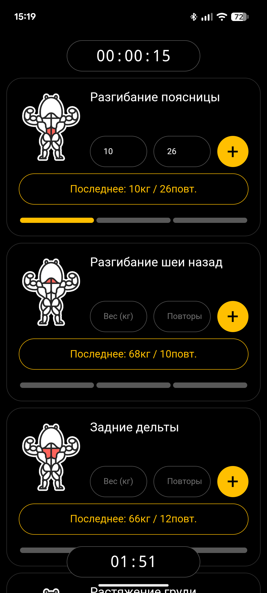
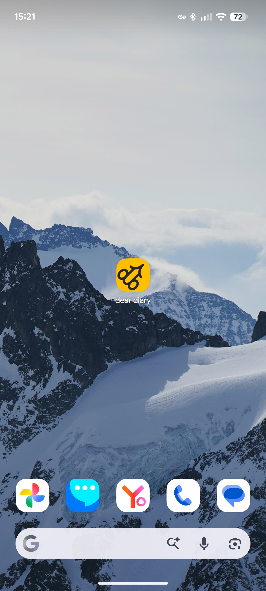

# Dear Diary - Минималистичный дневник тренировок

**Dear Diary** - это легкое Android-приложение для трекинга силовых тренировок, разработанное с упором на минимализм, скорость работы и полную автономность.

Приложение реализовано как нативная оболочка (WebView) вокруг локального веб-интерфейса, что обеспечивает плавную работу даже на старых устройствах и отсутствие зависимости от интернета, а так же простоту разработки.

## О проекте

Это инструмент для личного использования, адаптированный под специфические потребности в тренировочном процессе.

### Ключевые особенности:
- **Система 3 дней**: Тренировки распределены на 3 дня. Пока не завершены все три дня, цикл не сбрасывается.
- **Универсальные упражнения**: Иконки и названия упражнений абстрактны (например, иконка бицепса может означать любое упражнение на бицепс). Это позволяет менять программу тренировок без необходимости редактировать код приложения.
- **Быстрый ввод**:  вес и количество повторений из предыдущей тренировки в тот же день можно быстро заполнить соответствующей кнопкой.
- **Встроенные таймеры**: 
  - Общий таймер длительности тренировки.
  - Таймер отдыха (2 минуты) между подходами.
- **Темы оформления**: 
  - Светлая тема для дневного использования.
  - **True Black** темная тема для экономии заряда на OLED-экранах.
- **Offline-first**: Работает полностью без интернета. Все данные хранятся локально на устройстве.

## Дизайн и UX-решения

### Логотип и Айдентика
*   **Основной логотип:** Состоит из двух букв "d", одна из которых зеркально отражена. Вместе они формируют вектор графика, стремящийся вверх, что символизирует прогресс в тренировках.
*   **Анимация и Маскот:** При запуске приложения иконка трансформируется: буквы превращаются в милого хомячка, который ест зернышко. Этот элемент surprise-дизайна разрушает первоначальные ожидания пользователя и закрепляет образ маскота. Хомячок далее используется в других частях приложения как проводник и персонаж.

### Цветовая палитра и Темы
*   **Акцентный цвет:** Янтарный. Он яркий, но не агрессивный, создаёт ощущение энергии и света (ассоциация с солнцем).
*   **Светлая тема:** Белый фон. Кнопки залиты янтарным цветом для лучшей считываемости и привлечения внимания к целевым действиям.
*   **Тёмная тема:** Фон - чёрный (#000). Это решение принято для экономии заряда батареи на устройствах с OLED-экранами. Кнопки в этой теме не имеют сплошной заливки (только контур), чтобы не создавать излишний визуальный шум и сохранять энергоэффективность.
*   **Текст и рамки:** Используются оттенки белого и серого в зависимости от контрастности фона.

### Карточки упражнений
Каждое упражнение оформлено в виде карточки, содержащей:
1.  Иконку упражнения.
2.  Название.
3.  Форму ввода данных.
4.  Прогресс-бар подходов (разделен на 3 секции).
5.  Кнопку быстрого заполнения данными из предыдущих тренировок.

### Иконки упражнений
*   **Дизайн:** Стилизованное мускулистое тело с головой хомяка-маскота. Группа мышц, задействованная в упражнении, выделена розово-красным цветом.
*   **Адаптация под темы:** Иконки выполнены в виде контура на белом фоне. В тёмной теме белый фон иконки слегка выступает за границы основной фигуры, создавая эффект "стикера".
    *   *Причина решения:* Это позволило избежать отрисовки отдельного набора иконок для тёмной темы и сохранить целостность стиля, так как инверсия контуров (негатив) выглядела бы хуже и теряла детали.

### Интерактивные элементы
*   **Кнопка быстрого заполнения:** Выделена жёлтым контуром без заливки. Имеет меньший визуальный вес, чем основная кнопка отправки, но остается заметной благодаря цвету.
*   **Кнопка отправки формы:** Контрастная, с заливкой, так как это основное целевое действие (высокий приоритет).
*   **Выбор дня тренировки:**
    *   *Активный день:* Выделяется цветом (или его отсутствием в зависимости от темы).
    *   *Завершенный день:* Кнопка становится неактивной, приобретает серый пунктирный контур и теряет заливку, визуально сигнализируя о статусе "выполнено".

## Скриншоты

| Загрузка | Главный экран (Светлая) | Главный экран (Тёмная) |
|----------|-------------------------|------------------------|
|  |  |  |

| Тренировка (Светлая) | Тренировка (Тёмная) | Иконка |
|----------------------|---------------------|--------|
|  |  |  |

## Установка и запуск

### Вариант 1: Установка APK (Рекомендуется)

1. Скачайте файл **[dd.apk](https://github.com/Q2369/dear-diary/releases/download/v1.0/dd.apk)** из корня репозитория.
2. Разрешите установку из неизвестных источников в настройках вашего Android-устройства.
3. Запустите установочный файл.

### Вариант 2: Web версия для ознакомления

1. Откройте сайт **[dear-diary](https://q2369.github.io/dear-diary/)** на мобильном устройсте.
2. Если открыли на ПК, то откройте исследование элемента и выполните пункт 3.
3. Выберите формат экрана соответствующий экрану смартфона

## Как пользоваться

1. **Выбор дня**: На главном экране выберите день тренировки.
2. **Выполнение упражнений**:
   - Введите вес и количество повторений (или нажмите кнопку подставления прдыдущих значений).
   - Нажмите "+".
   - Запустится таймер отдыха на 2 минуты.
3. **Завершение**: После выполнения всех упражнений дня, день считается закрытым. Когда закрыты все 3 дня, цикл начинается заново.
4. **Настройки**: На главном экране можно сменить тему или полностью сбросить историю тренировок.

## Будущее проекта

Текущая версия является базовой (MVP). Планируется глобальное обновление с полной переработкой архитектуры и интерфейса, которое фактически станет новым приложением.
